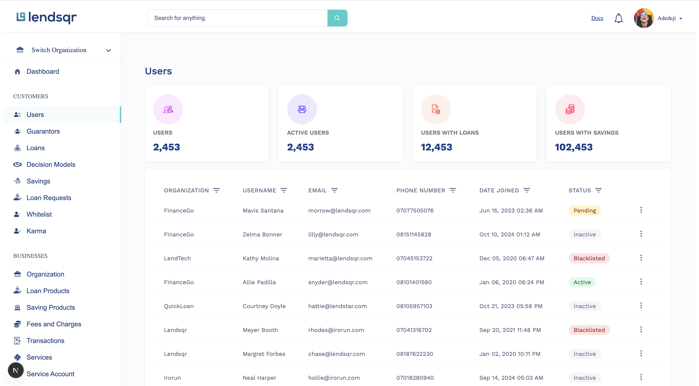

# Lendsqr User Management Interface



This project is a frontend implementation of the **Lendsqr User Management Dashboard**, built as part of a technical assessment for a frontend engineering role at **Lendsqr**. The application is developed using **React**, **TypeScript**, and **SCSS**, following best practices for performance, structure, and reusability.

## Getting Started

These instructions will help you set up a copy of the project on your local machine for development and testing purposes.

### Prerequisites

Before you begin, ensure you have met the following requirements:

* Node.js
* npm or Yarn

### Installing

Follow these steps to get your development environment up and running:

1. Clone the repository

```bash
git clone https://github.com/JusticeOpara/lendsqr-fe-test.git
cd lendsqr-fe-test
```

2. Install the dependencies:

```bash
npm install
```

1. Start the development server:

```bash
npm run dev
```

Your application should now be running on `http://localhost:5173`.

## Deployment

To deploy this project on a live system, follow these steps:

1. Build for production:

```bash
npm run build
```

## Built With

* React
* TypeScript
* SCSS

## Trade-offs & Areas for Improvement

* Used static data for filters; could be dynamic in real implementation
* Lacks backend; properties are fetched from a json file

## 🧠 Notes on Approach

### 🗂️ **Modular & Scalable Structure**

* Feature-based folder organization to support scalability and maintainability.

### 🧩 **Reusable Components**

* Components like `UserTable`, `StatusBadge`, and `Card` were built with props to support various data states.

### 🎯 **Focus on Clarity & UX**

* Design closely replicates the provided screenshot with attention to spacing, colors, and hierarchy.
* Included loading and empty states for a real-world feel.

### 📱 **Responsive by Default**

* Layout adapts to various screen sizes using grid/flexbox and media queries.
  
### 🧪 **Testing Ready**

* Wrote components and utilities to be **easily testable** with unit or integration tests.
* Utility functions are decoupled from UI for testability.

## 📬 Feedback

If you have any feedback, please reach out to me at `justiceopara33@gmail.com`
